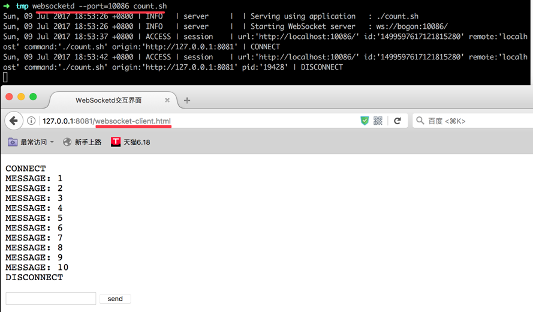
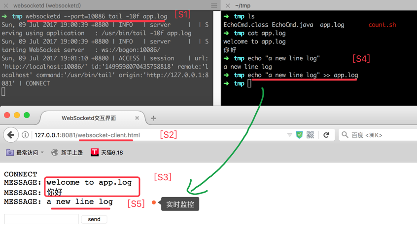
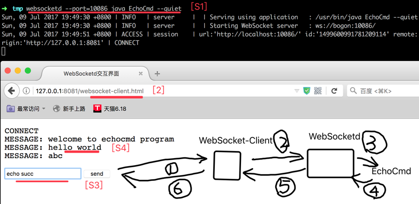
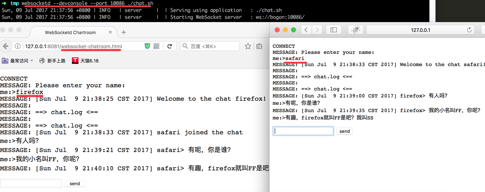

# WebSocketd

<!-- TOC depthFrom:1 depthTo:6 withLinks:1 updateOnSave:1 orderedList:0 -->

- [WebSocketd](#websocketd)
- [!/bin/bash](#binbash)
- [Count from 1 to 10 with a sleep](#count-from-1-to-10-with-a-sleep)
	- [客户端](#客户端)
	- [更多趣味实验](#更多趣味实验)
		- [日志输出到Web](#日志输出到web)
		- [Java程序双向交互](#java程序双向交互)
		- [5行代码实现聊天室](#5行代码实现聊天室)
- [附录](#附录)
	- [代码-1：websocket-client.html](#代码-1websocket-clienthtml)
	- [代码-2：EchoCmd.java](#代码-2echocmdjava)

<!-- /TOC -->

``websocket``是基于Web的双向通信。那``websocketd``是什么呢？web服务器兴起的时候，有人发明了``cgi``，它能把任何程序都嫁接到Web上去。只需要把应用程序的``stdin``和``stdout``都对接到web服务器上。``websocketd``的作者就很聪明，在``websocket``成为国际标准后，他用了类似``cgi``的思想，把任何应用都能弄到websocket上。

语法：

> ``websocketd [options] COMMAND [command args]``

- 样例-1：系统命令

``websocketd --port=8080 ls -l`` 表示在8080端口启动一个WebSocket服务，当客户端连接上来后，用``ls -l``跟客户端进行交互（效果就是会把``ls -l``的输出发送到客户端）。

- 样例-2：自定义脚本

官方案例，有个``count.sh``脚本：

``` bash
#!/bin/bash

# Count from 1 to 10 with a sleep
for ((COUNT = 1; COUNT <= 10; COUNT++)); do
  echo $COUNT
  sleep 0.5
done
```

执行：``websocketd --port=10086 count.sh``


## 客户端

当我们启动``websocketd``后，有了服务器，怎么构建一个客户端呢？我们给出一个简单的 [websocket-client.html](../websocket-client.html)，用浏览器或者``http-server``运行即可。

这个客户端有两块：一个是``id="vstdout"``，用来输出服务端发来的数据；另一个是``id="vstdin" ``用来把用户输入的信息发送到服务端。

比如用``websocket-client.html``页面访问``websocketd --port=10086 count.sh``的结果：



## 更多趣味实验

### 日志输出到Web

我们如何轻而易举的把服务器的日志，输出到Web上呢？每当服务器多出一行日志的时候，我们就把它转到Web界面上。
很简单，客户端依然是``websocket-client.html``，服务端依然是``websocketd``，只不过执行的命令是：

``` bash
$ websocketd --port=10086 tail -10f app.log
```



类似的，你还可以执行``websocketd --port=10086 ping www.baidu.com``。

### Java程序双向交互

如果平日里有个现有的Java程序，用户输入一个字符串，它回显一个同样的字符串。但是现在我想快速把它发布到互联网上，让大家都能跟它互动。代码详见[EchoCmd.java](../src/main/java/EchoCmd.java)。



### 5行代码实现聊天室

在``websocketd``官方，还给出了一个样例，仅仅只有5行代码，就是实现了一个聊天室程序 [chat.sh](https://github.com/joewalnes/websocketd/blob/master/examples/bash/chat.sh)：

``` bash
echo "Please enter your name:"; read USER
echo "[$(date)] ${USER} joined the chat" >> chat.log
echo "[$(date)] Welcome to the chat ${USER}!"
tail -n 0 -f chat.log --pid=$$ | grep --line-buffered -v "] ${USER}>" &
while read MSG; do echo "[$(date)] ${USER}> ${MSG}" >> chat.log; done
```

下面逐行解释一下：

- 第1行：向``stdout``提示输入用户名，通过``read USER``从``stdin``读取用户名，并保存到 ``$USER``变量里。
- 第2行：聊天室的消息用``chat.log``文件存储，所有加入聊天室的人说的话，都写入这个房间。每个用户的消息，用 ``$USER``前缀做标记。第2行，发送了一条系统消息，向房间宣布谁加入了房间。
- 第3行：向``stdout``提示欢迎。
- 第4行：把房间里 **其他人** 说的话，发送到``stdout``。
  - ``tail -f chat.log``表示追读日志，只要``chat.log``有新行，就会被读到。
  - ``tail -n 0``表示从最后0行读，我们平时见的``tail -10f chat.log``其实等效``tail -n 10 -f chat.log``的。
  - ``tail --pid=$$``是什么意思呢？其中：``$$``表示运行当前脚本时的进程号（自己的进程号）。接着``tail``的``--pid``参数是什么意思呢？首先这个``--pid``参数必须跟``-f``参数一起用，它表示当进程号为``--pid``的进程结束时，``tail -f``也就可以结束了。这样做的目的是当``chat.sh``结束时，能够结束``tail -f``，因为整个``tail -f``是一个子进程，因为后面有``&``表示后台运行。
  - ``grep -v "] ${USER}>"``表示排除自己说的话。``grep ABC``是检索出有ABC的行，而``grep -v ABC``是排除有ABC的行。
  - ``grep --line-buffered``表示强制为行缓存。Linux很多命令行都有缓存，而且有些默认是``fully-buffered``，表示缓冲区满了的时候，才一次性刷写，这样能提高IO性能。但是聊天程序需要实时性，所以我们期望，只要有一行完整的内容，就直接刷写。这个``--line-buffered``就表示只要有一行，就显示一行。不然，很可能对方说了10句，另外一方都看不到，到11句的时候，另一方突然一下子看了11句，影响用户体验。
  - ``&``：表示后台启动。把``tail -f``都放后台启动。尽管是后台启动，但是``tail -f``的输出，却依然可以在主进程。
- 第5行：第5行就很简单了，就是一个循环不断从``stdin``读取消息，把消息写入聊天室。

用两个浏览器FF和SS访问（这里用的HTML是``websocket-chatroom.html``）：




# 附录

## 代码-1：websocket-client.html

``` html
<!DOCTYPE html>

<head>
  <title>WebSocketd交互界面</title>
</head>

<body>
  <pre id="vstdout"></pre>

  <input type="text" name="cmd" id="vstdin" onkeydown = "if (event.keyCode == 13)
                        document.getElementById('btnsend').click()"/>

  <button type="button" id="btnsend">send</button>

  <script>

  // helper function: log message to screen
  function log(msg) {
    document.getElementById('vstdout').textContent += msg + '\n';
  }

  // setup websocket with callbacks
  var ws = new WebSocket('ws://localhost:10086/');

  ws.onopen = function() {
    log('CONNECT');
  };

  ws.onclose = function() {
    log('DISCONNECT');
  };

  // be notified from server and log the message into 'vscreen' element
  ws.onmessage = function(event) {
    log('MESSAGE: ' + event.data);
  };

  // add 'onclick' handler on 'send' Button
  document.getElementById('btnsend').onclick = function () {
    var cmdTxt = document.getElementById('vstdin').value;
    // alert(cmdTxt);
    ws.send(cmdTxt);
    document.getElementById('vstdin').value = null;
  };

  </script>

</body>

```

## 代码-2：EchoCmd.java

``` java
import java.io.BufferedReader;
import java.io.BufferedWriter;
import java.io.InputStreamReader;
import java.io.OutputStreamWriter;

public class EchoCmd {


	public static void main(String[] args) throws Exception {

		boolean isQuiet = (args.length > 0 && ("--quiet".equals(args[0]) || "-q".equals(args[0])));

		BufferedReader reader = new BufferedReader(new InputStreamReader(System.in));
		BufferedWriter writer = new BufferedWriter(new OutputStreamWriter(System.out));

		writer.write("welcome to echocmd program\r\n");
		writer.flush();
		try {
			while (true) {

				if (! isQuiet) {
					writer.write("input your cmd ('quit' to exit)>");
					writer.flush();
				}

				String cmd = reader.readLine();
				if ("quit".equalsIgnoreCase(cmd)) {
					writer.write("\t<echocmd quit, ByeBye");
					writer.flush();
					break;
				} else {
					if (! isQuiet) {
						writer.write("\t<echo your cmd: " + cmd + "\r\n");
					} else {
						writer.write(cmd + "\r\n");
					}

					writer.flush();
				}
			}
		} finally {
			if (reader != null) { reader.close(); }
			if (writer != null) { writer.close(); }
		}

	}

}

```
