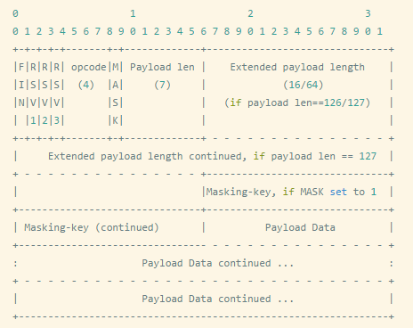

# http-server

<!-- toc -->

<!-- TOC depthFrom:1 depthTo:6 withLinks:1 updateOnSave:1 orderedList:0 -->

- [http-server](#http-server)
	- [使用说明](#使用说明)
	- [引言](#引言)
	- [内嵌HttpServer](#内嵌httpserver)
	- [requestHandler](#requesthandler)
		- [三种Handler写法](#三种handler写法)
		- [简易请求分发](#简易请求分发)
		- [vertx.web的Router](#vertxweb的router)
	- [websocketHandler](#websockethandler)

<!-- /TOC -->

## 使用说明

为了阅读时，能实践，请下载代码，并切换到相应的节点：

``` bash
$ git clone https://github.com/downgoon/vertx-hand-book.git
$ git checkout e1c742ddf63ba1057db2cf168a94e8317c1c9723
```

## 引言

刚接触[vertx](http://vertx.io/)的人，相信多数会被官方首页的一个超级简洁的``http-server``代码吸引：

``` java
import io.vertx.core.AbstractVerticle;
public class Server extends AbstractVerticle {
  public void start() {
    vertx.createHttpServer().requestHandler(req -> {
      req.response()
        .putHeader("content-type", "text/plain")
        .end("Hello from Vert.x!");
    }).listen(8080);
  }
}
```

本文大概讲解下这段代码。

## 内嵌HttpServer

构建一个``http-server``，只需要``vertx.core``，只需要3行：

``` java
Vertx vertx = Vertx.vertx();
HttpServer httpServer = vertx.createHttpServer();
httpServer.listen();
```

如果用``fluent``方式，更简洁：

``` java
Vertx.vertx().createHttpServer().listen();
```

我们自然会问，这样发一个http请求，它的处理结果是什么？的确，压根没有写怎么处理http请求的逻辑！
所以运行是会报错的：

``` java
Exception in thread "main" java.lang.IllegalStateException: Set request or websocket handler first
	at io.vertx.core.http.impl.HttpServerImpl.listen(HttpServerImpl.java:232)
	at io.vertx.core.http.impl.HttpServerImpl.listen(HttpServerImpl.java:207)
	at io.downgoon.httpgo.demo.HttpServerDemo.main(HttpServerDemo.java:12)
```

提示我们：
>Set request or websocket handler first （在``listen``监听端口前，请设置``requestHandler``或者``websocketHandler``）。

## requestHandler

### 三种Handler写法

关于``requestHandler``有两个方法：

``` java
/**
 * Set the request handler for the server to {@code requestHandler}. As HTTP requests are received by the server,
 * instances of {@link HttpServerRequest} will be created and passed to this handler.
 *
 * @return a reference to this, so the API can be used fluently
 */
@Fluent
HttpServer requestHandler(Handler<HttpServerRequest> handler);

/**
 * @return  the request handler
 */
@GenIgnore
Handler<HttpServerRequest> requestHandler();
```

>但这两个方法，并不是重载方法！！！它的风格彻底颠覆了``J2EE``规范，它实际上一个是``setRequestHandler``，另一个是``getRequestHandler``。

于是代码修改为：

``` java
Vertx vertx = Vertx.vertx();
HttpServer httpServer = vertx.createHttpServer();
httpServer.requestHandler(req -> {
  // do nothing
});
httpServer.listen(8080);
```		

设置了一个空处理，浏览器访问，就只能等着超时。如果我们要给一个响应，比如``Hello World``，代码如下：

``` java
httpServer.requestHandler(req -> {
			req.response().end("Hello World");
});
```

可以注意到，接口不像``J2EE``的``servlet``：

``` java
public void doGet(ServletHttpRequest req, ServletHttpResponse res) {

}
```

它的``http-response``，是作为``http-request``的属性的。

上述对HTTP请求的写法是``java8``的方式。我们也可以传统方式：

``` java
public static void main(String[] args) {

		Vertx vertx = Vertx.vertx();
		HttpServer httpServer = vertx.createHttpServer();

		httpServer.requestHandler(new HelloWorldHandler());

		httpServer.listen(8080);

	}

	public static class HelloWorldHandler implements Handler<HttpServerRequest> {
		@Override
		public void handle(HttpServerRequest request) {
			request.response().end("Hello World");
		}
	}
```

最后，我们介绍第3种写法，也是``Java8``中的，它特别像C语言中的``函数指针``，只要``签名相同``的方法（包括参数类型和数量一致，返回值类型似乎都可以不一致），就能借助``函数指针``把方法传递过去（程序=数据+计算。只有两者结合，才叫程序。很长一段时间，为了两者的结合，我们都只传递数据，但现在有一种思想，觉得数据挪动时间和带宽成本太高，应该传递计算）。第3种写法如下：

``` java
public static void main(String[] args) {

		Vertx vertx = Vertx.vertx();
		HttpServer httpServer = vertx.createHttpServer();

		HelloWorldHandler helloworld = new HelloWorldHandler();

    // 函数指针的写法
		httpServer.requestHandler(helloworld::onRequestEvent);

		httpServer.listen(8080);

	}

  // 无需实现 Handler<HttpServerRequest>接口
	public static class HelloWorldHandler  {
    // 只需要方法签名，跟Handler<HttpServerRequest>接口一致，方法名可以随便叫
		public void onRequestEvent(HttpServerRequest request) {
			request.response().end("Hello World");
		}

	}
```

刚才为什么说，返回值似乎都可以不一致呢？因为我们在``onRequestEvent``方法增加一个返回值，也是没有关系的：

``` java
public static class HelloWorldHandler  {

    // 返回值类型不再是 void， 而是 Integer
		public Integer onRequestEvent(HttpServerRequest request) {
			request.response().end("Hello World");
			return 0;
		}

	}
```

实际上，第3种写法，就是``vertx``官方拓展``Router``组件所采用的。什么是``Router``组件呢？简单说，一个``http-server``需要处理很多HTTP请求，需要按请求路径做分发处理，类似``servlet``的``web.xml``。

### 简易请求分发

我们可以写一个``DispatcherHandler``，来做请求分发，类似``niginx``基于``location``来分发，为了简单，我们只支持``严格匹配``。``DispatcherHandler.java``分发代码如下（详见``HttpServerDispatcherDemo.java``）：

``` java
public static class DispatcherHandler {

		private Map<String, Handler<HttpServerRequest>> mapper = new HashMap<String, Handler<HttpServerRequest>>();

    // 用来给server增加location处理
		public DispatcherHandler location(String location, Handler<HttpServerRequest> handler) {
			mapper.put(location, handler);
			return this;
		}

    // 依据路径严格匹配，做请求分发
		public void dispatch(HttpServerRequest request) {
			Handler<HttpServerRequest> handler = mapper.get(request.path());
			if (handler == null) {
				request.response().setStatusCode(404);
				request.response().end("location not found");
			} else {
				handler.handle(request);
			}
		}

	}
```

有了这个请求分发器，我们可以给``http-server``增加类似``nginx``的``location``处理：

``` java
DispatcherHandler dispatcherHandler = new DispatcherHandler();

dispatcherHandler.location("/hello", req -> {
    req.response().end("Hello World");
});

dispatcherHandler.location("/sayhi", req -> {
    String name = (req.getParam("name") == null ? "ghost" : req.getParam("name"));
    req.response().end("Hi, " + name);
});

// 通过函数指针，用dispatcherHandler来完全接管http-server的请求处理
httpServer.requestHandler(dispatcherHandler::dispatch);
```

我们看一下测试结果：

``` bash
$ curl -i http://localhost:8080/
HTTP/1.1 404 Not Found
Content-Length: 18

location not found%

$ curl -i http://localhost:8080/hello
HTTP/1.1 200 OK
Content-Length: 11

Hello World%

$ curl -i http://localhost:8080/sayhi\?name\=wangyi
HTTP/1.1 200 OK
Content-Length: 10

Hi, wangyi
```

可以看到上述分发代码正常工作了，如果我们要支持``RESTful``呢？比如除了基于路径，还需要基于方法来做分发。在``vertx.core``以外的拓展包``vertx.web``里面，有``Router``类，专门支持。它比我们刚才的分发要强大许多。

### vertx.web的Router

为了使用``Router``，我们需要引入：

``` xml
<dependency>
	<groupId>io.vertx</groupId>
	<artifactId>vertx-web</artifactId>
	<version>3.4.2</version>
</dependency>
```

接着我们引入``Router``代码（详见``HttpServerRouterDemo.java``）：

``` java
import io.vertx.core.Vertx;
import io.vertx.core.http.HttpServer;
import io.vertx.ext.web.Router;

public class HttpServerRouterDemo {

	public static void main(String[] args) {

		Vertx vertx = Vertx.vertx();
		HttpServer httpServer = vertx.createHttpServer();

    // 创建一个分发器
		Router router = Router.router(vertx);

    // 接管http-server的请求处理
    httpServer.requestHandler(router::accept);

		httpServer.listen(8080);
	}

}
```

首先我们会发现``Router``是拓展包里面的（包名是``io.vertx.ext.web.Router``），不是``core``包里面的。如上代码访问时，出现默认的处理器404：

``` bash
$ curl -i http://localhost:8080/
HTTP/1.1 404 Not Found
content-type: text/html; charset=utf-8
Content-Length: 53

<html><body><h1>Resource not found</h1></body></html>
```

按前面``DispatcherHandler``的功能需求，用``Router``来实现：

``` java
router.route("/hello").handler(routingContext -> {
			routingContext.response().end("Hello World");
		});

router.route(HttpMethod.GET, "/sayhi").handler(routingContext -> {
	 String name = routingContext.request().getParam("name");
	 if (name == null) {
			name = "ghost";
	}
  routingContext.response().end("Hi, " + name);
});
```

代码可读性很强，这里说几点编码风格的事：

- ``routingContext``: 依然不是``servlet``那种，把请求和响应作为两个参数分离传递，而是被封装到``routingContext``里面，它可以取出``request``，``response``，还能取出上下文。
- ``router.route(path).handler()``: 长期以来Java风格应该是``router.addRoute(path, handler)``，而这里``router.route()``就表示``addRoute()``了。再有handler不再是一个映射Value，而是作为route的一个属性。

如果我们只增加``route``，但是不注册``handler``呢？比如：

``` java
router.route("/nohandler");
```

这样的代码就好比传统风格下的：

``` java
router.addRoute("/nohandler", null);
```

因此还是请求不到，报告``404 NOT FOUND``。

----

## websocketHandler


>``WebSocket`` 协议在2008年诞生，**2011年成为国际标准**。所有浏览器都已经支持了。
>早期  [HTML5](http://www.jb51.net/w3school/html5/) 并没有形成业界统一的规范，各个浏览器和应用服务器厂商有着各异的类似实现，如 IBM 的 MQTT，Comet 开源框架等，直到 2014 年，HTML5 在 IBM、微软、Google 等巨头的推动和协作下终于尘埃落地，正式从草案落实为实际标准规范，各个应用服务器及浏览器厂商逐步 **开始统一** 。``WebSocket`` 最重要的就是 ``双向通信``，动机就是解决 [Server-Push](https://en.wikipedia.org/wiki/Push_technology)的场景。

``WebSocket``的特点：

- 双向通信：支持``Sever-Push``
- 寄生于HTTP: 端口依然是80和443（当``HTTPS``的时候），握手阶段走HTTP，握手完成后才切换到``WebSocket``。这样的好处是很容易通过防火墙。顺便说一下，HTTP服务器要很强大，协议解析的时候，有些是HTTP的，有些是``WebSocket``的，而且``WebSocket``又是寄生于HTTP的（在HTTP头里面发送一个声明说：“我要走WebSocket了”，服务器回答说：“Upgrate（升级到``WebSocket``）”）。
- 协议标识符``ws``： [ws://example.com:80/some/path](ws://example.com:80/some/path) 如果是SSL，则``wss``。
- 跟HTTP不是一个东西：``WebSocket``协议通信时，跟HTTP协议没半毛钱关系，它就是``Socket``（严格也不能这么讲，因为Socket是TCP层对应用层的接口，它本身并不是应用层协议，而WebSocket是应用层协议）；但修饰词``Web``是因为握手阶段需要在``HTTP``协议上发起一个``Upgrate request``（升级为``WebSocket``）。
- 数据载荷：可以是文本，也可以是二进制。


>``WebSocket`` is designed to be implemented in web browsers and web servers, but it **can be used by any client or server application**. The WebSocket Protocol is an **independent TCP-based protocol**. Its only relationship to HTTP is that its ``handshake`` is interpreted by HTTP servers as an ``Upgrade request``.[1]


>**The communications are done over TCP port number 80** (or 443 in the case of TLS-encrypted connections), which is of benefit for those environments which block non-web Internet connections using a firewall. （这点在大公司简直非常提供效率，一些大公司开其他端口，走的申请流程让人窒息，而80端口通常默认就是开通的）


### 握手报文

- **Client request** (``Upgrade request``)：客户端申请换道``websocket``

``` http
GET /chat HTTP/1.1
Host: server.example.com
Upgrade: websocket
Connection: Upgrade
Sec-WebSocket-Key: x3JJHMbDL1EzLkh9GBhXDw==
Sec-WebSocket-Protocol: chat, superchat
Sec-WebSocket-Version: 13
Origin: http://example.com
```

其中重要的两行：

>``Connection: Upgrade``     // TCP链接要升级换道，不走HTTP报文了。
>``Upgrade: websocket``     // 换道哪呢？``websocket``

- **Server response**:

``` http
HTTP/1.1 101 Switching Protocols
Upgrade: websocket
Connection: Upgrade
Sec-WebSocket-Accept: HSmrc0sMlYUkAGmm5OPpG2HaGWk=
Sec-WebSocket-Protocol: chat
```

回复也有：
>Upgrade: websocket
>Connection: Upgrade

另外注意：响应码不是``200``，而是``101 Switching Protocols``。


握手的奇特之处：在一个端口上，可以跑两种协议：HTTP和WebSocket。这点跟我们平时的绝大多数服务协议不同，我们都是一个端口一种协议；实际上，如果理解底层socket的话，要在一个端口上走两种协议其实并不难，只是报文解码和动作不同而已。

>The handshake resembles HTTP in allowing servers to handle HTTP connections as well as WebSocket connections **on the same port**. Once the connection is established, communication **switches to a bidirectional binary protocol which doesn't conform to the HTTP protocol**.

握手阶段，除了刚才提到的``Upgrade``关键字外，还有两个``Key``：请求中的``Sec-WebSocket-Key: x3JJHMbDL1EzLkh9GBhXDw==``，响应中的``Sec-WebSocket-Accept: HSmrc0sMlYUkAGmm5OPpG2HaGWk=``。前者是``随机数``的Base64编码，后者是它的``Hash值``的Base64编码。

### 默认跨域

平时``AJAX``的时候，有跨域问题。但浏览器的这个行为其实很扯淡，大家平时也都是设置为允许跨域，安全问题走安全机制，比如要求登陆。所以``WebSocket``的设计的时候，也注意到这个现实问题，所以，这次人家默认就是允许跨域的，但是依然把``Origin``上报上去，交给服务器去判断，要不要禁止某些``Origin``。

>It is important (from a security perspective) to validate the "Origin" header during the connection establishment process on the serverside (against the expected origins) to avoid Cross-Site WebSocket Hijacking attacks, which might be possible when the connection is authenticated with Cookies or HTTP authentication. It is better to use tokens or similar protection mechanisms to authenticate the WebSocket connection when sensitive (private) data is being transferred over the WebSocket.

### 读写数据

Websocket的数据传输是frame形式传输的，比如会 **将一条消息分为几个frame**，按照先后顺序传输出去。
这样做会有几个好处：
1）大数据的传输可以分片传输，不用考虑到数据大小导致的长度标志位不足够的情况。
2）和http的chunk一样，可以边生成数据边传递消息，即提高传输效率。

最早的``HTTP``都直接是一个``Content-Length``，这种协议实现简单。但弊端是，随着应用发展，如果包体部分太大，就会支持不了。所以后来引入了``chunked``传输，可以将报文分多个块。再到后来的协议，``websocket``和HTTP/2的设计，一上来就考虑了分块传输的问题，都能将一个大的报文分拆成多个``Frame``。除了大的考虑，``websocket``初衷还要解决``Server-Push``的问题，既然是``Server-Push``就有个问题是，事件是慢慢到达的，来一点内容，就实时推送一点，而不用等全部完后再推送。

> WebSocket transmissions are described as "messages", where **a single message can optionally be split across several data frames**. This can allow for sending of messages where initial data is available but the complete length of the message is unknown (it sends one data frame after another until the end is reached and marked with the FIN bit).




``vertx``在读写数据这块，有两个接口：一个是读写原生的``Frame``；另一个是读写消息（至于消息是否分拆成多个``Frame``由``vertx``底层决定，用户只用关心消息，当然用户可以设置``FrameSize``，这样底层可以知道该拆多大一块）。从数据类型来讲，可以读写二进制，也可以读写文本。


### 参考资料

- [阮一峰讲解WebSocket](http://www.ruanyifeng.com/blog/2017/05/websocket.html?utm_source=tuicool&utm_medium=referral)
- [Sever-Push](https://en.wikipedia.org/wiki/Push_technology)
- [WebSocketd实时监控轻而易举](http://websocketd.com/)
- [实时消息类应用](http://blog.sina.com.cn/s/blog_727942e70102x304.html)：AMQP,MQTT,WebSocket,XMPP
