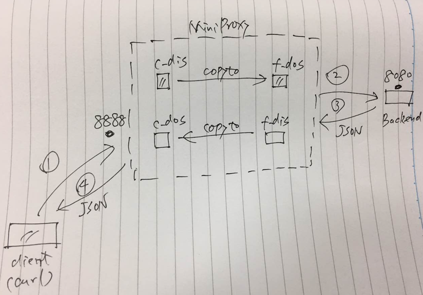
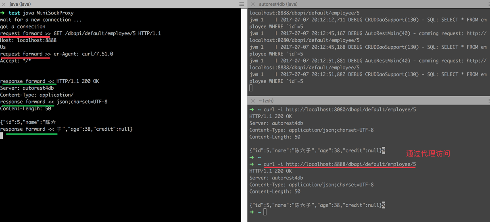
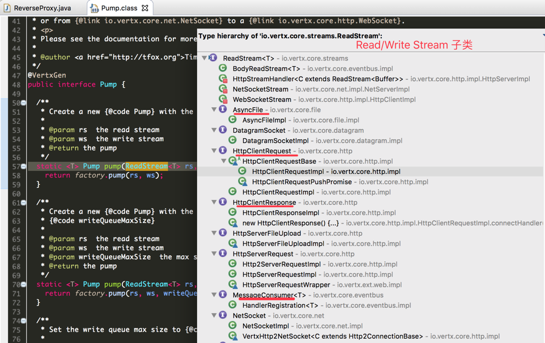

# reverse-proxy 反向代理

## 一个简单代理服务器

为了感受下代理服务器的基本原理，我们用传统代码，写了个简单的代理服务器，详见 [MiniSockProxy.java](../src/main/java/vertx/handbook/core/http/MiniSockProxy.java)，它的功能如图：



运行日志如下图：



它是一个``TCP``代理服务器，不仅仅可以走``HTTP``协议。它原理很简单，正如功能图中描述的，就做了``流复制``，并没有在中间做加工处理。

请求转发：

``` java
byte[] req_buf = new byte[64];
int req_size = -1;
while ((req_size = c_dis.read(req_buf)) != -1) { // forward request
  System.out.println("request forward >> " + new String(req_buf, 0, req_size));
  f_dos.write(req_buf, 0, req_size);
}
```

响应转发，几乎是同样的逻辑，不同的只是跑在不同的线程中（不然一个线程没法做到上行和下行同时进行）。

## Pump.pump 流复制

``vertx``为了方便做``proxy``这类应用，也支持``流复制``，还专门提供了一个工具，叫``Pump.pump(ReadStream, WriteStream)``，语义就是把数据从``ReadStream``读出来，并写入``WriteStream``里面。更重要的是，``vertx``把很多东西都做成了``ReadStream``和``WriteStream``的子类，所以可以很轻松的在``文件``，``网络流``，HTTP Body 等之间做快速的``流复制``。




# 附录-1：API Gateway 相关

通过``API Gateway``的，一般都会在HTTP头上，留下点痕迹，比如常见的：

- ``X-Forward-For``：用来向后端应用服务器传递请求方的源IP的。
- ``Via``：表示Gateway的信息。比如：``Via: 1.1  webcache_250_199.hexun.com:80 (squid)``。
